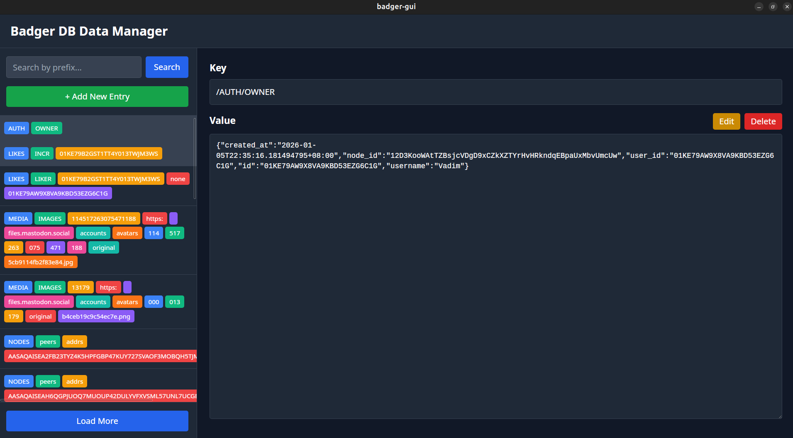

[](https://snapcraft.io/badger-gui)
[](https://github.com/Warp-net/badger-gui/releases)
[](LICENSE)
[](https://github.com/Warp-net/badger-gui/stargazers)

# Badger DB GUI

**A desktop GUI to browse, inspect, and edit [BadgerDB](https://github.com/dgraph-io/badger) key-value databases — no scripts, no shell, no guesswork.**



`badger-gui` is a lightweight desktop application for working with embedded BadgerDB
key-value stores through a visual interface. Open a database, browse and search keys,
view and edit values, and run full CRUD operations directly — instead of writing
one-off Go programs to inspect your data. It's handy during development, debugging,
and incident analysis, when you just need to look inside a Badger store quickly.

> [!NOTE]
> This is **not** a vibe-coding experiment.
> `badger-gui` was extracted from the [Warpnet](https://github.com/Warp-net/warpnet)
> project, where it's used as a real tool against production BadgerDB stores.
> The code follows consistent conventions, is well-tested, and aims for
> reliable, predictable behavior over quick hacks.
> Bug reports and contributions are welcome.

## Why badger-gui?

- Inspect embedded BadgerDB data without writing throwaway code or scripts
- Navigate large, nested key spaces with color-coded, delimiter-aware visualization
- Safely view, edit, add, and delete key-value pairs from a GUI
- Works with encrypted databases and Snappy / ZSTD compression

## Features

- **Database Connection**: Open Badger databases with support for:
  - Custom database path selection
  - Encryption key support
  - Compression options (Snappy, ZSTD, None)
  - Custom key delimiter for nested key parsing

- **Data Management**: Full CRUD operations
  - List all keys with pagination
  - View key-value pairs
  - Add new entries
  - Update existing values
  - Delete entries
  - Search by key prefix

- **User Interface**:
  - Color-coded nested key visualization
  - Split-panel design for browsing and editing
  - Dark theme interface
  - Error handling with modal dialogs

## Download

- [Release binaries](https://github.com/Warp-net/badger-gui/releases)
- [Snap Store](https://snapcraft.io/badger-gui) (Linux)

## Building

### Prerequisites

- Go 1.18 or higher
- Node.js 14 or higher
- Wails CLI (optional for development)

### Build Application

```bash
# For development (requires Wails CLI)
wails dev -m -nosyncgomod -tags webkit2_41

# For production
wails build -m -nosyncgomod -tags webkit2_41
```

## Usage

1. **Open Database**:
   - Launch the application
   - Click "Browse" to select your Badger database folder
   - (Optional) Enter decryption key if database is encrypted
   - Select compression type used by the database
   - Enter a delimiter character for nested keys (e.g., `/` for keys like `items/book/123`)
   - Click "Open Database"

2. **Manage Data**:
   - View all keys in the left panel
   - Click on a key to view its value
   - Use "Add New Entry" to create new key-value pairs
   - Click "Edit" to modify values
   - Click "Delete" to remove entries
   - Use the search box to filter keys by prefix
   - Click "Load More" for paginated results

3. **Key Format**:
   - Keys are displayed as color-coded blocks separated by your chosen delimiter
   - Example: `items/book/123` displays as [items][book][123] with different colors
   - Each level of the hierarchy gets a distinct color for easy visualization

## Architecture

- **Backend**: Go with Badger DB integration
- **Frontend**: Vue 3 with Vue Router
- **Communication**: Wails v2 binding for Go-JavaScript interop
- **Styling**: Tailwind CSS (inline utility classes)

## Development

### Adding New Features

1. Update backend methods in `app.go`
2. Update frontend components in `frontend/src/`
3. Run `wails build -m -nosyncgomod -tags webkit2_41`

## License

See [LICENSE](LICENSE) file for details.
